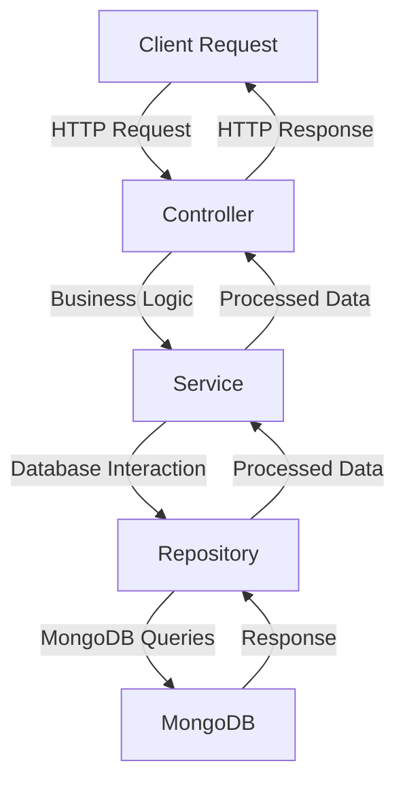
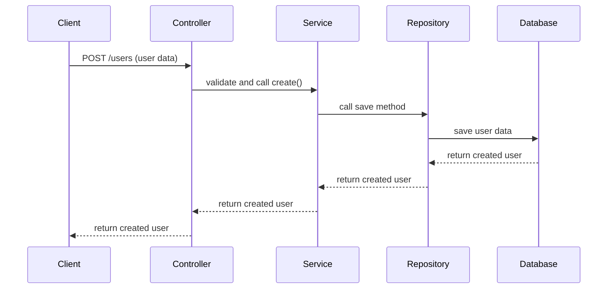
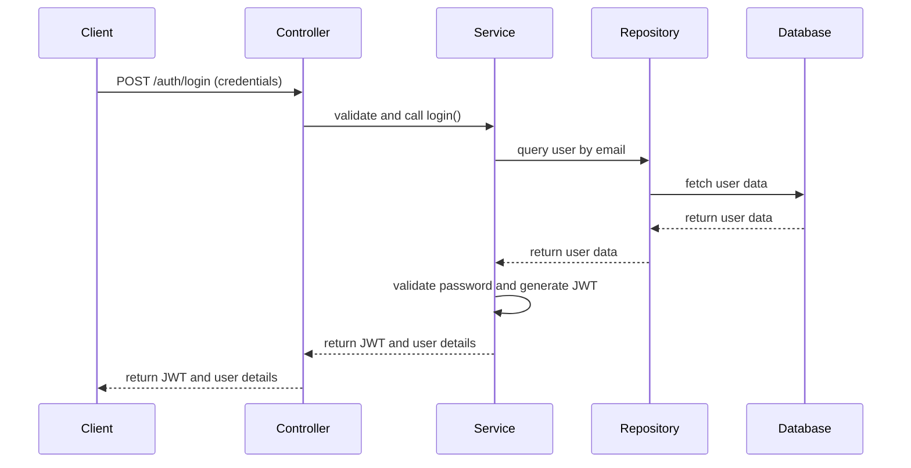

  

[circleci-image]: https://img.shields.io/circleci/build/github/nestjs/nest/master?token=abc123def456
[circleci-url]: https://circleci.com/gh/nestjs/nest

  
A progressive <a href="http://nodejs.org" target="_blank">Node.js</a> framework for building efficient and scalable server-side applications.

    

  
    
  

  <!--
  -->

## Description

[Nest](https://github.com/nestjs/nest) framework TypeScript starter repository.

### Project Flow

1. **Environment Setup**:
   - Configure environment variables in the `.env` file (e.g., `MONGO_URL` for MongoDB connection).

2. **Module Structure**:
   - Each module follows the CSR pattern (Controller, Service, Repository).
   - Example: The `users` module contains:
     - `users.controller.ts`: Handles HTTP requests and responses.
     - `users.service.ts`: Contains business logic.
     - `users.repository.ts`: Manages database interactions.

3. **Database Integration**:
   - MongoDB is used as the database.
   - Mongoose is integrated for schema-based data modeling.

4. **Global Configurations**:
   - Middleware like `helmet` for security and `rateLimit` for request throttling.
   - Global pipes for validation and transformation.

5. **Routing**:
   - API routes are prefixed with `api/v1`.
   - Versioning is enabled for future scalability.

6. **Testing**:
   - Unit tests and E2E tests are configured using Jest.
   - Example test scripts:
     - `npm run test`: Run all tests.
     - `npm run test:e2e`: Run end-to-end tests.

7. **Deployment**:
   - The project can be deployed using platforms like AWS or Docker.
   - Refer to the [deployment documentation](https://docs.nestjs.com/deployment) for detailed steps.

### Diagram Flow

Below is a high-level flow of the project:

### Register Flow

Below is the detailed flow for the "Register" process:

1. **Client Request**:
   - The client sends a `POST` request to the `/users` endpoint with the user data (e.g., `username`, `email`).

2. **Controller**:
   - The `UsersController` receives the request and calls the `create` method.
   - The `create` method validates the input using DTOs and forwards the data to the `UsersService`.

3. **Service**:
   - The `UsersService` processes the business logic.
   - It calls the `UsersRepository` to interact with the database.

4. **Repository**:
   - The `UsersRepository` uses the `UserModel` (Mongoose) to save the user data in the MongoDB database.

5. **Database**:
   - MongoDB stores the user data and returns the created user object.

6. **Response**:
   - The `UsersController` sends the created user object back to the client as a response.

### Login Flow

Below is the detailed flow for the "Login" process:

1. **Client Request**:
   - The client sends a `POST` request to the `/auth/login` endpoint with login credentials (e.g., `email`, `password`).

2. **Controller**:
   - The `AuthController` receives the request and calls the `login` method.
   - The `login` method validates the input using DTOs and forwards the data to the `AuthService`.

3. **Service**:
   - The `AuthService` verifies the credentials by querying the database through the `UsersRepository`.
   - If the credentials are valid, it generates a JWT token.

4. **Repository**:
   - The `UsersRepository` retrieves the user data from the database based on the provided email.

5. **Response**:
   - The `AuthController` sends the JWT token and user details back to the client as a response.

